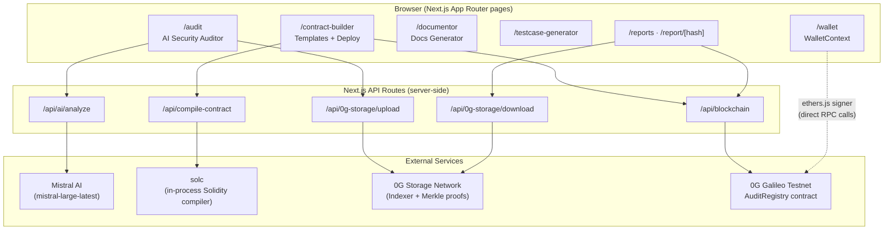

# 🛡️ BlockPilot

**AI-Powered Smart Contract Security for 0G Network**

---

## What is BlockPilot?

BlockPilot is a comprehensive security platform that makes smart contract auditing instant and accessible. Instead of waiting weeks and paying thousands for traditional audits, developers get enterprise-grade security analysis in seconds using AI—completely free.

Built exclusively for 0G Network, BlockPilot combines Mistral AI's language models with 0G's decentralized storage to create a complete security workflow: audit, store, verify, and document your contracts all in one place.

---

## Features

### 🔍 AI Security Auditor

Paste your contract code and get instant security analysis. The AI scans for vulnerabilities, classifies them by severity (Critical, High, Medium, Low), and provides actionable recommendations. Each audit includes:

- Detailed vulnerability breakdown with explanations
- Gas optimization suggestions to reduce costs
- Security score (1-5 stars) with deployment guidance
- Professional PDF reports you can share with your team

All audit reports are automatically stored on 0G Storage and registered on-chain for permanent verification.

### 🏗️ Smart Contract Builder

Deploy production-ready contracts without writing code. Choose from battle-tested templates:

- **ERC20 Token** - Simple, secure token with mint/burn/pause functionality
- **NFT Collection** - ERC721 with configurable supply and metadata

Each template is self-contained (no external dependencies) and designed to score 4-5 stars on security audits. Enable "Auto-Audit" to get your contract analyzed immediately after deployment.

### 📊 Decentralized Reports

Every audit report is stored on 0G Storage with cryptographic verification. Reports are permanent, tamper-proof, and retrievable by hash. The on-chain registry at `0x5bA4CB3929C75DF47B8b5E6ca6c7414a5E1a3DB0` maintains an immutable record of all audits.

View your complete audit history in the Reports dashboard, with direct links to 0G ChainScan for verification.

### 📝 Documentation Generator

Generate professional documentation for any smart contract. The AI analyzes your code and creates comprehensive docs including:

- All functions with parameters and descriptions
- Events and state variables
- Purpose-tailored content (team docs, client presentations, security audits)
- Technical level adjustment (beginner to advanced explanations)

Export as professional PDF with BlockPilot branding or Markdown for version control.

### 🧪 Test Case Generator

Get complete test suites for your contracts in seconds. Choose your framework:

- **Hardhat** - JavaScript/TypeScript tests with Chai assertions
- **Foundry** - Solidity-native tests with fuzzing support
- **Remix** - Step-by-step manual testing instructions

The AI generates comprehensive tests covering all functions, edge cases, and access control.

### 🎨 Modern Interface

Clean, intuitive design with light and dark themes. The unique hanging bulb toggle adds a playful touch while keeping the interface professional. Everything is responsive and works beautifully on any device.

---

## Architecture

BlockPilot is a Next.js App Router application. The frontend never talks to Mistral AI, 0G Storage, or the blockchain directly — everything is routed through Next.js API routes, which keep API keys and the storage/deploy private key server-side.

### Module breakdown

| Layer | Module | Responsibility |
|---|---|---|
| **Pages** | `src/app/audit/page.tsx` + `src/components/audit/*` | Drives the audit flow: code input → AI analysis → results → on-chain registration → 0G Storage upload |
| | `src/app/contract-builder/page.tsx`, `templates.ts` | Renders ERC20/NFT templates, compiles them, deploys via the connected wallet, optionally triggers auto-audit |
| | `src/app/documentor/page.tsx` | Sends contract code to the AI route and renders generated documentation (PDF/Markdown export via `utils/generateDocsPDF.ts`) |
| | `src/app/testcase-generator/page.tsx` | Generates Hardhat/Foundry/Remix test suites via the AI route |
| | `src/app/reports/page.tsx`, `src/app/report/[hash]/page.tsx` | Lists on-chain audits (`getAllAudits`) and renders a single report fetched from 0G Storage by hash |
| | `src/app/wallet/page.tsx`, `src/contexts/WalletContext.tsx` | MetaMask connection, network switching, balance display for the 0G Galileo Testnet |
| **API routes** | `api/ai/analyze/route.ts` | Server-side call to Mistral AI; builds the audit prompt, normalizes the JSON response, returns a `computeJobId` |
| | `api/compile-contract/route.ts` | Compiles Solidity source in-process with `solc`, resolving OpenZeppelin imports from `node_modules` |
| | `api/0g-storage/upload/route.ts`, `download/route.ts` | Thin wrappers around `src/lib/storage.ts` for storing/retrieving audit reports |
| | `api/blockchain/route.ts` | Read-only `ethers.Contract` calls against the `AuditRegistry` contract (`getAllAudits`, `getAuditorHistory`, `getContractAudits`, `getTotalContracts`) |
| **Lib / utils** | `src/lib/storage.ts` | Real 0G Storage integration using `@0gfoundation/0g-storage-ts-sdk` (`Indexer`, `MemData`) — uploads/downloads with Merkle proof verification |
| | `src/utils/contracts.ts` | `AuditRegistry` contract address + ABI |
| | `src/utils/zeroGStorage.ts` | Client-side helpers that call the storage API routes |
| | `src/utils/zeroGCompute.ts` | 0G Compute integration scaffold (router/marketplace endpoints); currently a partial integration pending compute credits |
| | `src/utils/web3.ts`, `src/config/wallet.ts` | Chain config (RPC, explorer, chain ID) and wallet helpers |
| **On-chain** | `AuditRegistry` (Solidity) | Stores `contractHash`, star rating, severity counts, `reportHash` (0G Storage pointer), auditor address, and `computeJobId` per audit; emits `AuditRegistered` |

### End-to-end audit flow

1. User pastes contract code into `/audit`.
2. Frontend calls `POST /api/ai/analyze` → Mistral AI returns vulnerabilities, recommendations, gas tips, and a star rating.
3. The full report JSON is sent to `POST /api/0g-storage/upload` → `src/lib/storage.ts` uploads it to the 0G Storage network and returns a Merkle root hash.
4. The user's wallet signs a transaction calling `registerAudit(...)` on the `AuditRegistry` contract, storing the star rating, issue counts, and the 0G Storage report hash on-chain.
5. `/reports` and `/report/[hash]` read audit metadata from the contract (`/api/blockchain`) and the full report body from 0G Storage (`/api/0g-storage/download`), giving every audit a permanent, verifiable, and publicly retrievable record.

---

## Technology

**Frontend:** Next.js 14, React 18, TypeScript, Tailwind CSS, Framer Motion

**AI:** Mistral AI (mistral-large-latest model)

**Blockchain:** ethers.js v6, 0G Galileo Testnet (Chain ID: 16602)

**Storage:** 0G Storage with Merkle root verification

**Smart Contracts:** Solidity 0.8.19, custom audit registry

---

## 0G Network Integration

BlockPilot is built from the ground up for 0G Network:

**0G Galileo Testnet** - All contracts deploy to 0G's testnet with optimized gas patterns

**0G Storage** - Audit reports stored decentralized with cryptographic verification

**0G Compute** - Foundation ready for distributed AI analysis (partial integration)

**On-Chain Registry** - Immutable audit records at `0x5bA4CB3929C75DF47B8b5E6ca6c7414a5E1a3DB0`

**ChainScan Integration** - Direct links to 0G's block explorer for transparency

Network details:
- RPC: `https://evmrpc-testnet.0g.ai`
- Explorer: `https://chainscan-galileo.0g.ai`
- Chain ID: 16602 (0x40BA)

---

## Security Ratings

| Stars | What It Means |
|:---:|:---|
| ⭐⭐⭐⭐⭐ | Perfect - Zero vulnerabilities, ready to deploy |
| ⭐⭐⭐⭐ | Excellent - Minor optimizations suggested, safe to deploy |
| ⭐⭐⭐ | Good - Some issues found, fix before deploying |
| ⭐⭐ | Risky - Critical vulnerabilities detected, do not deploy |
| ⭐ | Dangerous - Major security flaws, needs complete rewrite |

---

## Why BlockPilot?

**Speed** - Get security audits in 30 seconds instead of waiting weeks

**Cost** - Free AI analysis vs thousands in traditional audit fees

**Decentralized** - Reports stored on 0G Storage, not centralized servers

**Verified** - On-chain registry provides immutable proof of audits

**Complete** - Security, documentation, and testing in one platform

**Developer-Friendly** - Clean interface, instant feedback, professional exports

---

## Live Demo

Try BlockPilot now: **[blockpilot-0g.vercel.app](https://blockpilot-0g.vercel.app/)**

Connect your wallet to 0G Galileo Testnet and start auditing contracts instantly.

---

## License

MIT License - See [LICENSE](LICENSE) for details

---

*Built with ❤️ for the 0G community*
